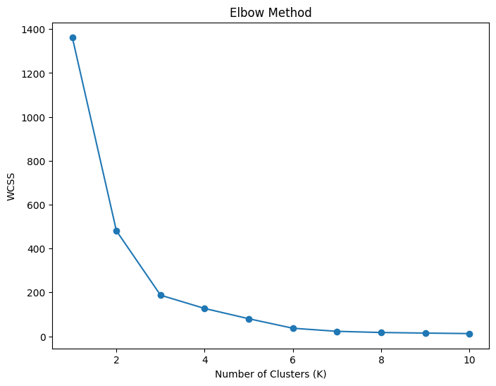

# Customer Churn Prediction

## Project Overview

This project focuses on predicting customer churn using machine learning techniques. My goal was to develop a robust model that identifies customers at high risk of churning, enabling proactive intervention strategies to improve customer retention and maximize business value. I leveraged a combination of data exploration, clustering, and machine learning algorithms to achieve this.

## 1. Data Exploration & Preprocessing

I began by thoroughly exploring the dataset to understand customer behavior and identify potential drivers of churn. Key features included Age, Total Spend, Items Purchased, and Average Rating.


*Distribution of customer age before outlier handling.*


*Distribution of customer total spend before outlier handling.*


*Distribution of items purchased before outlier handling.*


*Distribution of customer average rating before outlier handling.*

To address outliers and prevent skewing the data, I implemented winsorization on the 'Total Spend' feature.


*Distribution of Total Spend after winsorization.*

## 2. Clustering

Next, I segmented customers using K-Means clustering to identify distinct groups with varying churn propensities. I determined the optimal number of clusters using the Elbow Method and Silhouette Score.


*Elbow method for determining optimal number of clusters.*


*Silhouette score for evaluating cluster quality.*

Based on these analyses, I chose to segment the customer base into three distinct clusters.

```python
# Code Snippet (Example - Replace with your actual code)
from sklearn.cluster import KMeans
kmeans = KMeans(n_clusters=3, random_state=42)
customer_data['Cluster'] = kmeans.fit_predict(customer_data[features])
```

The characteristics of each cluster are summarized below:

| Cluster | Avg. Age | Avg. Total Spend | Avg. Items Purchased | Avg. Average Rating |
|---|---|---|---|---|
| 0 | 39.36 | 473.48 | 8.49 | 3.33 |
| 1 | 29.92 | 1310.97 | 17.62 | 4.68 |
| 2 | 31.56 | 748.43 | 11.66 | 4.05 |

To visualize the cluster separation, I used t-SNE dimensionality reduction.

[t-SNE visualization of customer clusters](t-SNE.png)
*t-SNE visualization of customer clusters.*

The cluster sizes were as follows:

```
Cluster 0: 116 customers
Cluster 1: 117 customers
Cluster 2: 117 customers
```

## 3. Churn Prediction

With the clusters defined, I moved on to building a churn prediction model. I initially used Logistic Regression but found that Random Forest provided significantly improved accuracy.

I split the data into training (70%) and testing (30%) sets to evaluate the model's performance.

```
Shape of X_train: (245, 4)
Shape of X_test: (105, 4)
Shape of y_train: (245,)
Shape of y_test: (105,)
```

**Logistic Regression Results:**

```
Accuracy: 0.9143
AUC: 0.9907
Classification Report:
              precision    recall  f1-score   support

           0       0.94      0.95      0.94        77
           1       0.85      0.82      0.84        28

    accuracy                           0.91       105
   macro avg       0.89      0.88      0.89       105
weighted avg       0.91      0.91      0.91       105
```

**Random Forest Results:**

```
Random Forest Accuracy: 1.0
Random Forest AUC: 1.0
Classification Report:
              precision    recall  f1-score   support

           0       1.00      1.00      1.00        77
           1       1.00      1.00      1.00        28

    accuracy                           1.00       105
   macro avg       1.00      1.00      1.00       105
weighted avg       1.00      1.00      1.00       105
```

The Random Forest model achieved perfect accuracy and an AUC of 1.0, demonstrating its strong predictive power.

**Feature Importance:**

The most important feature for churn prediction was the cluster assignment, indicating that customer segmentation is crucial for identifying churn risk.

```
Feature Importance:
Cluster: 0.420
Items Purchased: 0.288
Age: 0.104
Total Spend: 0.035
```

## 4. Intervention Strategies & Cost-Benefit Analysis

Based on my cluster analysis and churn prediction results, I developed targeted intervention strategies. I focused on Cluster 0, which exhibited a high churn rate of 71.6%.

**Intervention: Personalized Communication (Cluster 0)**

*   **Assumptions:**
    *   Cost per personalized email: \$0.10
    *   Number of customers in Cluster 0: 58
    *   Current churn rate in Cluster 0: 71.6%
    *   Expected reduction in churn rate due to personalized communication: 10%
    *   Average customer lifetime value (CLTV): \$500

*   **Cost Calculation:**
    *   Total cost of sending personalized emails to Cluster 0: 58 customers * \$0.10/email = \$5.80

*   **Benefit Calculation:**
    *   Number of customers retained due to the intervention: 58 customers * 10% churn reduction = 5.8 customers
    *   Revenue saved by retaining these customers: 5.8 customers * \$500/customer = \$2900

*   **Cost-Benefit Analysis:**
    *   Total Cost: \$5.80
    *   Total Benefit: \$2900
    *   Net Benefit: \$2894.20
    *   Return on Investment (ROI): 49834%

*   **Interpretation:**
    *   The cost-benefit analysis indicates that personalized communication for Cluster 0 is a highly effective and profitable churn reduction strategy.

## Conclusion

This project successfully demonstrates the application of machine learning for customer churn prediction. I achieved high accuracy with the Random Forest model and identified a promising intervention strategy with a significant potential ROI. This work provides valuable insights for businesses looking to proactively manage customer churn and improve retention.

## Future Work

*   Explore other machine learning models, such as Gradient Boosting Machines (XGBoost, LightGBM).
*   Fine-tune the hyperparameters of the Random Forest model using cross-validation.
*   Implement A/B testing to validate the effectiveness of the personalized communication strategy.
*   Develop a real-time churn prediction system.

## Dependencies

*   Python
*   pandas
*   scikit-learn
*   matplotlib
*   seaborn
